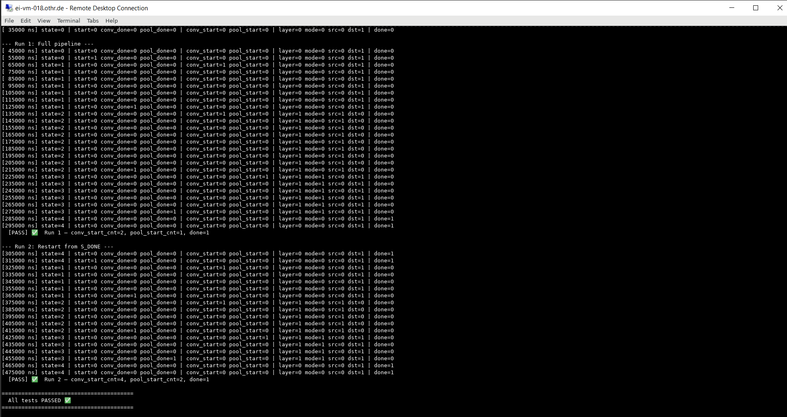

# Weekly Progress Report – Week 10
**Date:** February 08, 2026
**Project:** Digital Design of a Basic CNN Accelerator on ASIC (IHP 130nm)
---
### Accomplished This Week
#### CNN Architecture & System-Level Design
This week focused exclusively on implementing and fully verifying the address generation module. Integration and memory modeling are deferred to the following week.
- Finalized the project scope and design assumptions:
  - CNN accelerator implemented solely to validate the ASIC digital design flow (RTL → Simulation → Synthesis → P&R → Post-Layout)
  - Explicitly excluded dataset handling, training, inference accuracy evaluation, and external memory interfaces
- Reviewed and aligned CNN fundamentals with hardware implementation:
  - Convolution, kernel, stride, padding, ReLU, MaxPooling
  - Neuron modeled as MAC operation
- Locked the final CNN architecture:
  - Input: 32×32×1 grayscale
  - Conv1: 3×3 kernel, stride=1, padding=1, 4 output channels + ReLU
  - Conv2: 3×3 kernel, stride=1, padding=1, 8 output channels + ReLU
  - MaxPool: 2×2 kernel, stride=2
  - Output: 16×16×8 feature map
- Defined fixed-point data formats and numerical precision:
  - Activations: 8-bit unsigned
  - Weights: 8-bit signed
  - Accumulator: 32-bit (to prevent overflow during MAC operations)
- Calculated and validated feature map memory requirements:
  - Input: 1 KB
  - Conv1 output: 4 KB
  - Conv2 output: 8 KB (worst case)
  - Pooled output: 2 KB
- Designed Ping-Pong memory architecture for feature maps:
  - Two 8 KB SRAM banks (A/B) — one for reading current layer, one for writing next layer
  - Automatic bank swapping between layers
- Defined weight storage strategy:
  - Extremely small total weight size (Conv1: 36 bytes, Conv2: 288 bytes)
  - Implemented as ROM or hard-coded constants (no external loading)
- Completed the top-level block diagram:
  - Top Controller (FSM)
  - Address Generator
  - Shared Convolution Engine (time-multiplexed for both layers)
  - Feature SRAM A/B
  - Weight ROM
  - MaxPool Engine

### RTL Design Progress
#### Controller FSM Design
- Designed and implemented the **top-level controller FSM**:
  - State sequence: `IDLE → CONV1 → CONV2 → POOL → DONE`
  - Generated one-cycle start pulses for convolution and pooling engines
  - Implemented explicit ping-pong buffer swapping logic after each layer
  - [rtl/controller_fsm.md](../rtl/controller_fsm.md)
- Ensured strict separation of concerns:
  - Control logic (FSM)
  - Address generation (future module)
  - Datapath execution (convolution & pooling)

### Simulation & Verification (University Linux Server)
#### Testbench Development
- Implemented a **dedicated SystemVerilog testbench** for `controller_fsm`:
  - Generated clock, reset, start pulse, and artificial `conv_done` / `pool_done` handshaking signals
  - Added internal monitors to track FSM state transitions, layer selection, buffer swapping, and pulse generation
  - Included pulse counters to verify correct assertion counts (`conv_start` ×2, `pool_start` ×1)
  - [rtl/tb_controller_fsm.md](..rtl/tb_controller_fsm.md)
#### Simulation Execution
- Ran simulation using **Cadence Xcelium (xrun)** on the university Linux server
- Final command:
  ```bash
  xrun -sv rtl/tb_controller_fsm.sv rtl/controller_fsm.sv \
       -access +rwc -timescale 1ns/1ps

- Simulation completed successfully:
  - Correct FSM sequencing
  - Proper buffer swapping
  - Exact pulse counts: conv_start_cnt=2, pool_start_cnt=1
  - Final done = 1
  - Result: PASS ✓
  

### Challenges & Debugging

- Issue 1: File Not Found Errors
  - Problem: xrun could not locate RTL or testbench files
    -Root Cause: Incorrect relative paths and directory assumptions
    →**Solution:** Explicitly provided correct paths to rtl/ directory
- Issue 2: Multiple Drivers Error (always_ff)
  - Problem: Multiple drivers detected on always_ff output variable pool_start_cnt
    - Root Cause: Variable initialized at declaration (int pool_start_cnt = 0) + assigned inside always_ff
    → **Solution:** Removed declaration-time initialization; ensured single driver inside always_ff block

### Key Learnings / Insights

- Controller-first RTL development provides a stable backbone for the entire accelerator
- Early focused simulation of control logic significantly reduces future integration risk
- Cadence Xcelium enforces stricter SystemVerilog semantics than many open-source simulators
- Clear directory structure and explicit file paths are critical when working on shared Linux servers
- Small, targeted testbenches are highly effective for early module validation
- Cadence tools strictly enforce single-driver rule for always_ff; declaration init counts as a driver

### Plan for Next Week
- Integrate addr_gen with controller_fsm
- Begin behavioral modeling of feature SRAMs (A/B)
- Prepare interfaces and testbench extensions for convolution engine integration
- Add synthesis-safety cleanup