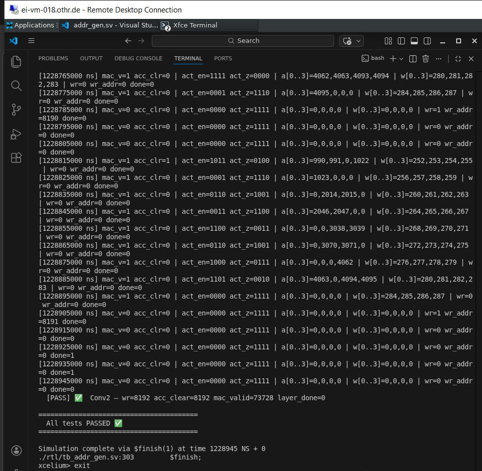

# Weekly Progress Report – Week 11  
**Date:** February 15, 2026

### Accomplished This Week
- This week focused exclusively on implementing and fully verifying the address generation module. Integration and memory modeling are deferred to the following week.
- Fully designed and implemented the **Address Generation (`addr_gen`)** module for the CNN accelerator:
  - [rtl/addr_gen.md](../rtl/addr_gen.md)
  - Developed a dedicated FSM for address sequencing:
    - States: `AG_IDLE → AG_NEWPIX → AG_TAPS → AG_WRITE → AG_NEXT → AG_DONE`
    - Clean separation between combinational next-state logic and sequential state register
    - Eliminated potential multi-driver conflicts on state signals
  - Implemented complete nested-loop traversal in hardware:
    - Outer loop: output channels (`oc`)
    - Spatial loops: row (`y`), column (`x`)
    - Inner loops: input channels (`ic`), kernel taps (`ky`, `kx`)
    - 4-lane MAC tap batching for parallel processing
  - Realized correct CHW (Channel-Height-Width) memory addressing:
    - Activation SRAM read addresses
    - Weight ROM indexing
    - Output feature map write addresses
  - Implemented efficient zero-padding logic using address-boundary checks:
    - Same-padding support (3×3 kernel, pad=1)
    - Generated `act_zero` and `act_rd_en` signals for out-of-bound taps
  - Produced precise datapath control signals:
    - `mac_valid`: asserted for each valid 4-lane tap group
    - `acc_clear`: asserted exactly once per output pixel
    - `out_wr_en`: asserted once per completed output pixel
    - `layer_done`: asserted after final output pixel of the layer
- Developed a structured, parameter-driven **testbench** (`tb_addr_gen.sv`):
  - [rtl/tb_addr_gen.md](../rtl/tb_addr_gen.md)
  - Automatic aggregate counters for `mac_valid`, `acc_clear`, `out_wr_en`, `layer_done`
  - First-pixel correctness checks
  - Full-layer cycle-count validation against expected values
  - Watchdog timer to prevent simulation deadlock

- Executed comprehensive simulation using **Cadence Xcelium (xrun)** on the university Linux server:
  - **Conv1 verification**:
    - 4096 output writes
    - 3 MAC groups per output pixel
  - **Conv2 verification**:
    - 8192 output writes
    - 9 MAC groups per output pixel
  - Verified mathematical consistency:
    - Conv2 total `mac_valid` pulses = 8192 × 9 = 73,728
  - All tests passed successfully with no functional errors
  

### Results & Outputs
- Fully functional, parameterized, and simulation-verified `addr_gen` RTL module
- Correct traversal of spatial and channel dimensions across both convolution layers
- Accurate tap grouping aligned with 4-lane MAC datapath
- Verified zero-padding behavior at image boundaries
- Clean, standalone functional validation independent of higher-level integration

### Key Learnings / Insights
- Strict separation between level-based completion signals (`layer_done`) and pulse-based control signals is essential to avoid FSM skipping or deadlock in higher-level modules
- Mathematical derivation of expected cycle counts and pulse totals is a powerful technique for validating accelerator control logic early
- Hardware nested-loop implementation requires careful rollover and boundary handling to prevent off-by-one errors
- Address-based padding logic is significantly more memory-efficient than expanding the feature map with explicit padding

### Challenges & Blocking Points
- Initial state-transition logic introduced potential multi-driver conflicts on FSM state  
  → **Solution:** Restructured combinational next-state logic and removed redundant assignments
- Ensuring correct tap grouping (`ceil(taps/4)`) without off-by-one errors  
  → **Solution:** Added explicit `last_tap_group` detection logic
- Race conditions in testbench aggregate counters  
  → **Solution:** Used careful posedge-based monitoring and synchronized sampling

### Plan for Next Week (Week 12)
- Integrate `addr_gen` module with `controller_fsm`
- Implement behavioral models for Feature SRAM A/B (ping-pong banks)
- Begin subsystem-level integration testing (controller + address generation + SRAM models)
- Prepare interfaces and control signals for future Convolution Engine integration